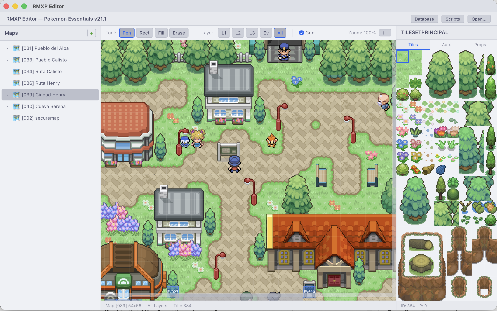
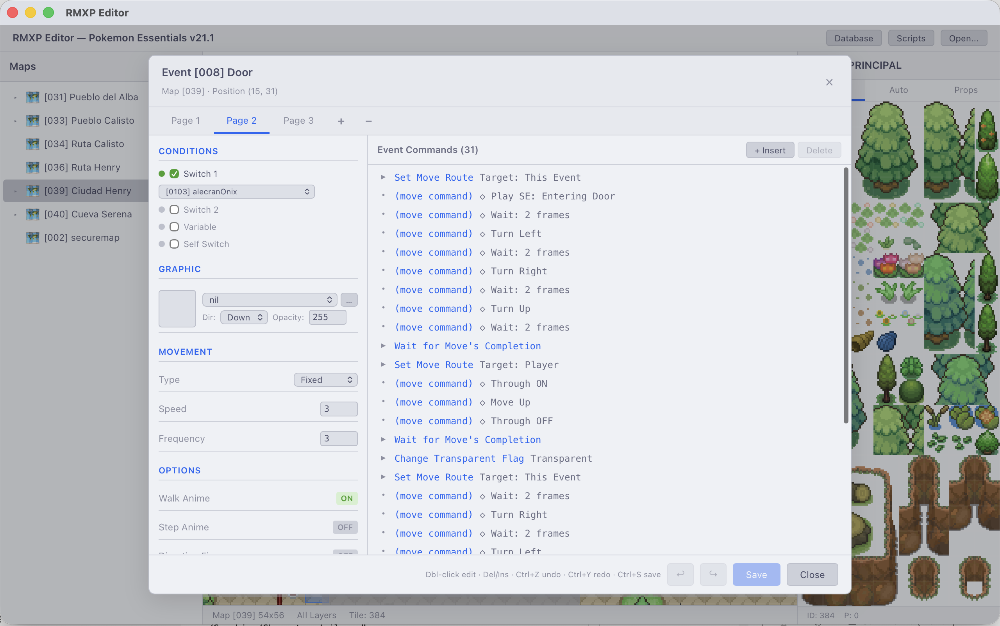
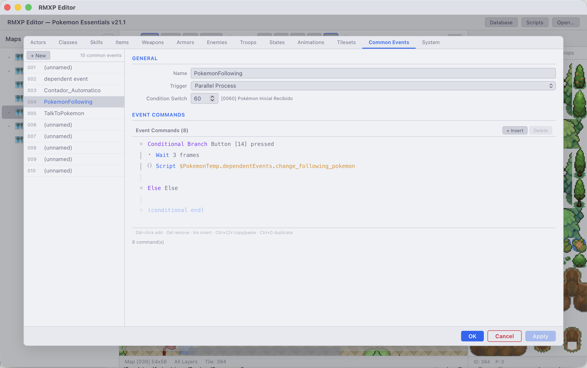
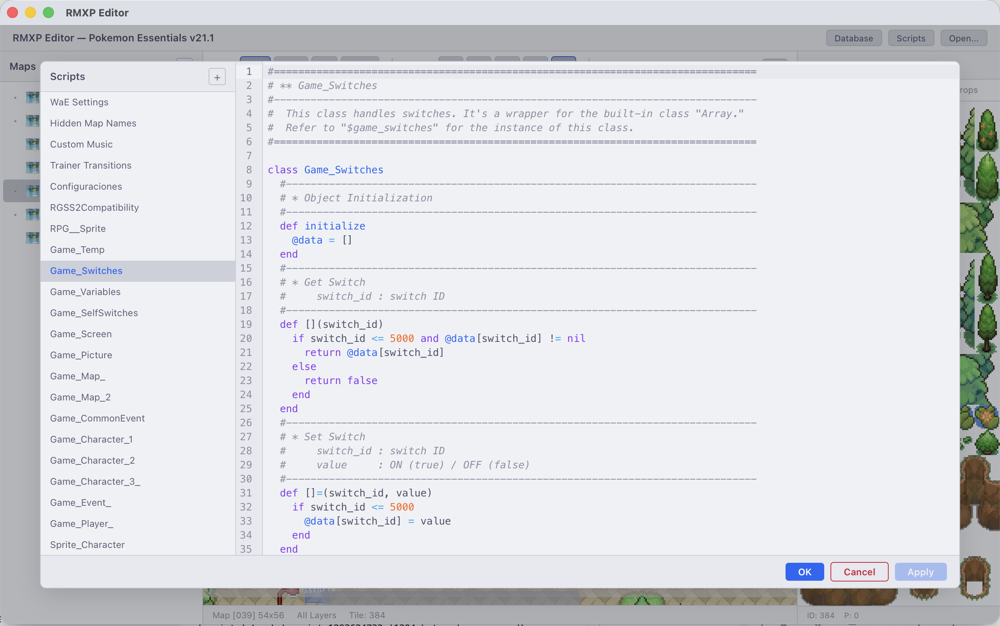

<div align="center">

# RMXP Editor

**A modern, cross-platform editor for RPG Maker XP projects**

[](https://v2.tauri.app/)
[](https://react.dev/)
[](https://www.typescriptlang.org/)
[](https://www.rust-lang.org/)
[](LICENSE)

The original RMXP editor is a 32-bit Windows application from 2004. This reimplements it as a native cross-platform desktop app, reading and writing the original `.rxdata` binary format directly — no Ruby runtime required. Built with Pokémon Essentials v21.1 in mind.



</div>

---

## What it does

| Module | Highlights |
|---|---|
| 🗺️ **Map Editor** | 3 tile layers + Events, autotiles, pencil/rect/fill/eraser, undo/redo, zoom, pan, grid, DPR-aware rendering |
| 🎭 **Event Editor** | Full command set, multi-page events, move route editor, character sprite preview, copy/paste commands |
| 🗃️ **Database** | All 13 RMXP data tabs — Actors, Classes, Skills, Items, Weapons, Armors, Enemies, Troops, States, Animations, Tilesets, Common Events, System |
| 📜 **Script Editor** | CodeMirror 6, Ruby syntax highlighting, global search across all scripts, per-script dirty tracking |
| 📍 **Starting Point** | Visual ⌂ marker on the map + right-click → Set as Starting Point |
| 📋 **Event Clipboard** | Right-click → Copy/Paste events across tiles |

---

## Stack

| Layer | Technology |
|---|---|
| Frontend | React 19 · TypeScript · Vite |
| Desktop shell | Tauri v2 (Rust) |
| Binary format | Custom Ruby Marshal v4.8 parser/serializer (pure Rust) |
| Map rendering | HTML5 Canvas 2D · `requestAnimationFrame` |
| Code editor | CodeMirror 6 |
| Audio | rodio (Rust) |
| Theme | Catppuccin Latte |

---

## Getting started

### Prerequisites

- [Node.js](https://nodejs.org/) v18+
- [Rust](https://www.rust-lang.org/tools/install) (latest stable)
- [Tauri v2 system dependencies](https://v2.tauri.app/start/prerequisites/)

```bash
# Install dependencies
npm install

# Development
npm run tauri dev

# Production build
npm run tauri build
```

Output bundle: `src-tauri/target/release/bundle/`

---

## Keyboard shortcuts

| Shortcut | Context | Action |
|---|---|---|
| `Ctrl+S` | Global | Save all dirty editors |
| `Ctrl+O` | Global | Open project folder |
| `Ctrl+Z` / `Ctrl+Y` | Map · Event Editor | Undo / Redo |
| `Ctrl+Shift+F` | Script Editor | Global search across all scripts |
| `Double-click` | Map canvas | Open event / create event (on Events layer) |
| `Right-click` | Map canvas | Tile context menu |
| `Middle-click drag` | Map canvas | Pan viewport |
| `Ctrl+scroll` | Map canvas | Zoom |
| `Insert` / `Delete` | Event command list | Add / remove command |
| `Ctrl+C/V/D` | Event command list | Copy / Paste / Duplicate |
| `Escape` | Event Editor | Cancel with unsaved-changes guard |

---

## Architecture

```
src/                              # React + TypeScript frontend
├── App.tsx                       # Root shell — project state, unified save context
├── context/
│   └── ProjectSaveContext.tsx    # Global dirty/save coordination across all editors
├── components/
│   ├── MapEditor/                # Canvas tile editor with drawing tools
│   ├── MapTree/                  # Hierarchical map list with context menu
│   ├── TilesetPalette/           # Tileset + autotile selector
│   ├── EventEditor/              # Page editor, command picker, move route editor
│   ├── ScriptEditor/             # Script list, CodeMirror panel, global search
│   └── DatabaseEditor/
│       ├── tabs/                 # 13 data-category tabs
│       └── controls/             # Shared controls (AssetPicker, TilePropertyEditor …)
├── services/
│   ├── tauriApi.ts               # Tauri IPC wrappers (typed)
│   ├── imageLoader.ts            # Asset-protocol image loading with cache
│   ├── mapRenderer.ts            # Canvas renderer — tiles, autotiles, event markers, start position
│   ├── mapEditor.ts              # Paint operations, flood fill, undo/redo stack
│   ├── eventCommands.ts          # Command catalog, summary text, picker categories
│   └── autotileData.ts           # 48-pattern autotile rect lookup table
└── types/                        # TypeScript types and RMXP constants

src-tauri/                        # Rust backend
├── src/
│   ├── commands/                 # Tauri IPC handlers (project, map, database, scripts, audio)
│   ├── marshal/                  # Ruby Marshal v4.8 reader + writer
│   ├── models/                   # RMXP data models (Map, Tileset, Event, System, Table …)
│   └── state/                    # Shared app state
└── Cargo.toml
```

### Binary format

All game data lives in `.rxdata` files — Ruby's binary Marshal format (v4.8). This editor ships a pure-Rust Marshal reader/writer covering every RMXP object type: `RPG::Map`, `RPG::Event`, `RPG::Tileset`, `RPG::System`, `Table`, `Color`, `Tone`, `RPG::AudioFile`, and more. `Scripts.rxdata` is zlib-compressed; the editor decompresses and recompresses it transparently.

---

## Screenshots

| Map Editor | Event Editor |
|---|---|
|  |  |

| Database — Tilesets | Script Editor |
|---|---|
|  |  |

---

## Roadmap

```
✅ Ruby Marshal v4.8 parser/serializer
✅ Project loading — Game.rxproj, MapInfos.rxdata, map tree
✅ Map editor — tile layers, autotiles, drawing tools, undo/redo, zoom/pan
✅ Event system — viewer, full command set, move routes, character sprites
✅ Database editor — all 13 tabs
✅ Script editor — CodeMirror 6, Ruby highlighting, global search
✅ Unified save flow — global dirty tracking, OK / Cancel / Apply
✅ Starting position — map marker + context-menu setter
✅ Event clipboard — copy/paste events across tiles via right-click
⬜ PBS file integration (Pokémon Essentials species, moves, items, trainers)
⬜ Playtest launcher
```

---

<div align="center">
  <sub>Not affiliated with Enterbrain, Maruno, or the Pokémon Essentials team · MIT License</sub>
</div>
