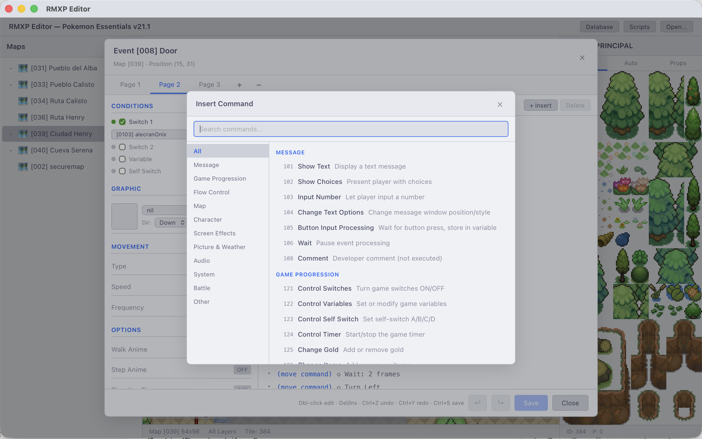
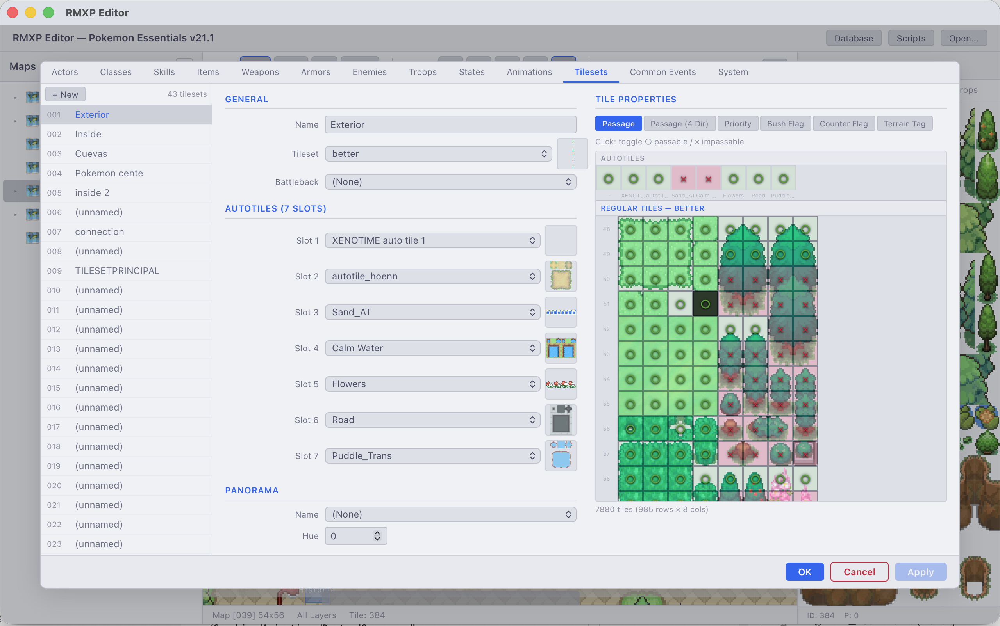

# RMXP Editor

A modern, cross-platform editor for **RPG Maker XP** projects, aiming for **1:1 feature parity** with the official RMXP editor while adding modern conveniences. Built specifically with **Pokémon Essentials v21.1** support in mind.


_The modern, light-themed interface capturing the classic RMXP workflow_

Built with [Tauri v2](https://v2.tauri.app/) + React + TypeScript for a native desktop experience on macOS, Windows, and Linux.

## Project Status

This editor faithfully recreates the functionalities of the original RPG Maker XP, offering a familiar environment for veterans while upgrading the underlying technology.

**Current Implementation Status:**

- **Core:** Native .rxproj and .rxdata parsing (custom Rust implementation).
- **Map Editor:** Feature-complete (Layers 1-3, Events, Autotiles, Zoom, Undo/Redo).
- **Database:** Full implementation of all 13 legacy tabs.
- **Events:** Comprehensive interpreter and editor support for event commands.
- **Scripts:** Enhanced Ruby script editor with modern syntax highlighting.

## Features

### Map Editor

- Visual tile-based map editing with a real-time canvas renderer
- **1:1 RMXP Layer System**: Full support for Layers 1, 2, 3, and Events
- **Authentic Autotiles**: 7-slot autotile system with animated rendering
- Tileset palette with clickable tile grid and autotile previews
- Drawing tools: Pencil, Rectangle, Flood Fill, Eraser
- Undo/Redo with full history stack
- Zoom and pan navigation
- Grid and event marker overlays
- DPR-aware rendering for Retina/HiDPI displays

### Event System


_Full Event Editor with conditions, triggers, and page management_

- Event viewer with markers on the map canvas
- Full event editor with page management (add, delete, copy pages)
- Double-click events on the map to open the editor
- **Move Route Editor**: Define complex movement patterns for events
- **Comprehensive Command Set**: Inline parameter editors for the vast majority of RMXP commands
- Command picker modal with category sidebar and keyboard search
- Keyboard shortcuts: Insert, Delete, Ctrl+C/V/D, Ctrl+Z/Y
- Sprite preview with character sheet rendering


_Command selection providing access to standard RMXP event logic_

### Database Editor


_Tabbed Database Editor managing all game data_

- Full tabbed interface covering all 13 RMXP data categories:
  - **Actors** — stats, exp curves, equipment, class assignment
  - **Classes** — learnable skills, stat growth curves, element/state rank tables
  - **Skills** — scope, cost, animations, audio, element/state associations
  - **Items** — consumables, equipment, key items with parameter bonuses
  - **Weapons** — stats, elements, states, animations, audio
  - **Armors** — defense stats, guard elements/states, auto-state
  - **Enemies** — stats, loot drops, element/state ranks, treasure tables
  - **Troops** — enemy positioning editor, battle event pages with full command editing
  - **States** — restrictions, ratings, auto-release, animations
  - **Animations** — frame-by-frame cell editor, real-time preview canvas, timing/flash/SE editing
  - **Tilesets** — passage, priority, and terrain tag grid editors with tileset image overlay
  - **Common Events** — trigger types, switch conditions, full event command editing
  - **System** — title/game-over graphics, start position, music/sound config, vocabulary
- Shared controls: asset pickers (graphics + audio with preview/playback), ID selectors, set editors, parameter curve editors


_Tileset configuration including passage and terrain tags_

### Script Editor


_Modern code editor with Ruby syntax highlighting and search_

- Full-featured code editor based on CodeMirror 6
- **Ruby Syntax Highlighting** with huge file support
- Smart indentation and bracket matching
- **Script List Management**: Create, rename, delete, and reorder scripts
- **Search & Replace**: text search within scripts
- Unsaved changes tracking (dirty state indicators)
- Custom theme (Catppuccin Latte) for a modern look

### Project Management & Tilesets

- Native folder picker to open any RMXP project
- Parses `Game.rxproj`, `MapInfos.rxdata`, `Tilesets.rxdata`, and individual map files
- Reads and writes all database `.rxdata` files
- Hierarchical map tree with parent/child relationships
- **Tileset Support**: Loads RMXP tileset images via Tauri's asset protocol
- 7-slot autotile system with animated autotile rendering
- Auto-opens the last edited map on project load

## Tech Stack

- **Frontend:** React 19, TypeScript, Vite
- **Backend:** Rust (Tauri v2)
- **Binary parsing:** Custom Ruby Marshal v4.8 deserializer/serializer (reads and writes `.rxdata` files directly)
- **Rendering:** HTML5 Canvas with requestAnimationFrame loop
- **Theme:** Catppuccin Latte

## Architecture

```
src/                            # React frontend
├── components/
│   ├── MapEditor/              # Canvas-based map editor with drawing tools
│   ├── MapTree/                # Hierarchical map list panel
│   ├── TilesetPalette/         # Tileset/autotile selector
│   ├── EventEditor/            # Event page editor, command param editors, command picker
│   ├── ScriptEditor/           # Script list + code editor panels
│   ├── DatabaseEditor/         # Tabbed database editor
│   │   ├── tabs/               # 13 data category tabs (Actors, Classes, Skills, etc.)
│   │   └── controls/           # Shared controls (AssetPicker, TilePropertyEditor, etc.)
│   ├── MapProperties/          # Map settings dialog
│   ├── common/                 # Shared UI primitives
│   └── shared/                 # Cross-component utilities
├── services/
│   ├── tauriApi.ts             # Tauri IPC command wrappers
│   ├── imageLoader.ts          # Asset protocol image loading with caching
│   ├── mapRenderer.ts          # Canvas tile renderer (regular + autotile)
│   ├── mapEditor.ts            # Paint operations and undo/redo
│   ├── eventCommands.ts        # Command catalog, summary formatting, picker categories
│   └── autotileData.ts         # 48-pattern autotile lookup table
└── types/                      # TypeScript type definitions and RMXP constants

src-tauri/                      # Rust backend
├── src/
│   ├── commands/               # Tauri IPC command handlers
│   ├── marshal/                # Ruby Marshal v4.8 binary format parser/serializer
│   └── models/                 # RMXP data structures (Map, Tileset, Event, Table, etc.)
└── Cargo.toml
```

## Development

### Prerequisites

- [Node.js](https://nodejs.org/) (v18+)
- [Rust](https://www.rust-lang.org/tools/install) (latest stable)
- [Tauri v2 prerequisites](https://v2.tauri.app/start/prerequisites/) for your platform

### Setup

1. Install dependencies:

   ```bash
   npm install
   ```

2. Run in development mode:

   ```bash
   npm run tauri dev
   ```

3. Build for production:
   ```bash
   npm run tauri build
   ```

## Roadmap

- [x] **Phase 1** — Project loading, Ruby Marshal parser, map tree
- [x] **Phase 2** — Map editor with tile rendering, drawing tools, undo/redo
- [x] **Phase 3** — Event system viewer and editor
- [x] **Phase 4** — Database editors (all 13 RMXP data categories with full editing)
- [x] **Phase 5** — Script editor with syntax highlighting
- [ ] **Phase 6** — PBS file integration and Pokémon Essentials-specific tooling

## License

MIT.
This project is not affiliated with Enterbrain, Maruno, or the Pokémon Essentials team.
