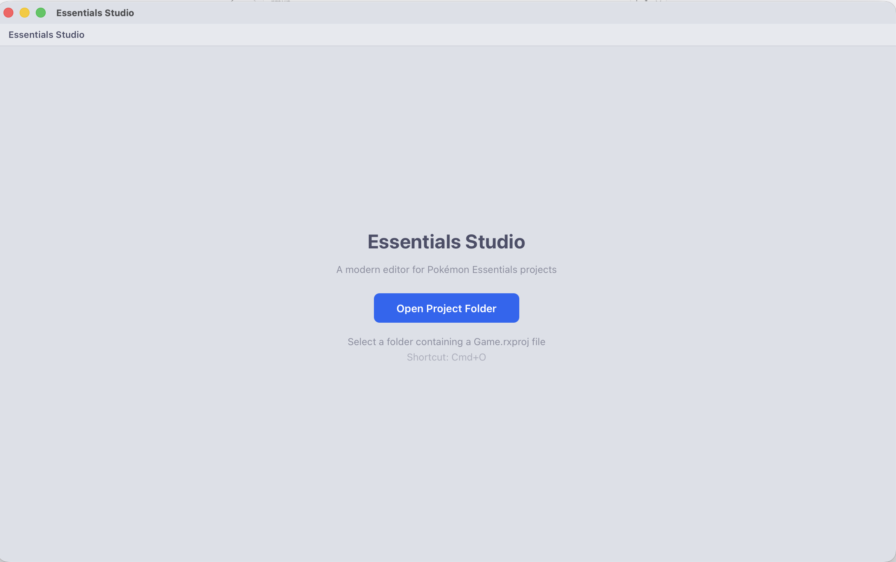
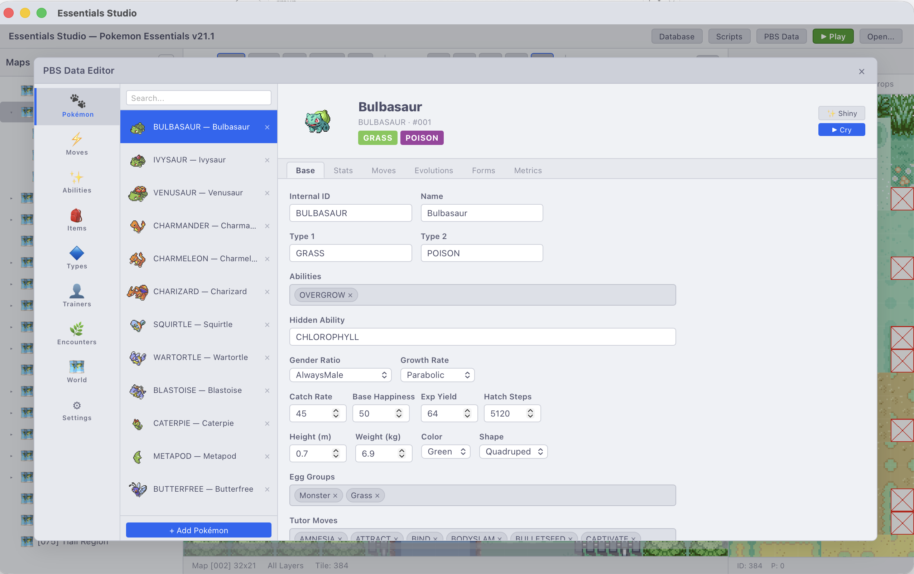
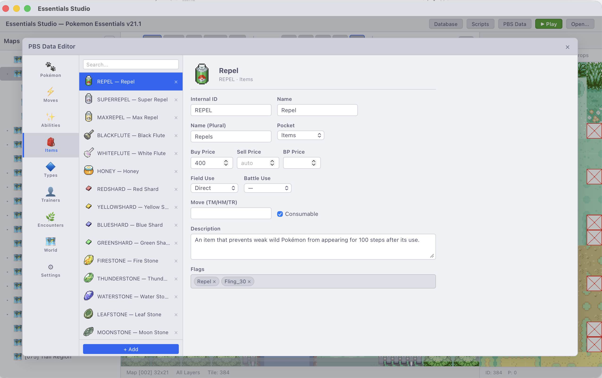
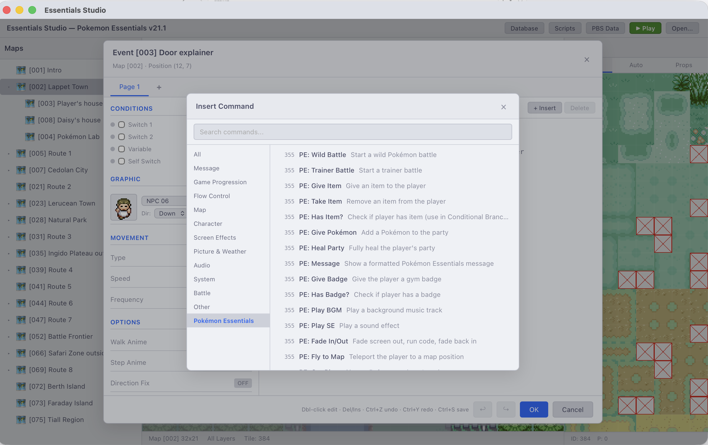

<div align="center">

# Essentials Studio

**A modern, cross-platform editor for Pokémon Essentials v21.1 projects**

[](https://v2.tauri.app/)
[](https://react.dev/)
[](https://www.typescriptlang.org/)
[](https://www.rust-lang.org/)
[](LICENSE)



The original RPG Maker XP editor is a 32-bit Windows app from 2004. Essentials Studio replaces it with a native, cross-platform desktop application that reads and writes both `.rxdata` binary files and the full Pokémon Essentials PBS text format — no Ruby runtime, no Wine, no compromises.

</div>

---

## Screenshots

| PBS Editor — Pokémon | PBS Editor — Items |
|---|---|
|  |  |

| Event Editor — PE Commands | |
|---|---|
|  | |

---

## What's inside

### Map Editor
Tile painting across 3 layers, full autotile support (all 48 patterns), pencil / rectangle / fill / eraser tools, undo/redo, zoom, pan, grid overlay. Events layer shows inline sprite previews. Right-click context menu for copying events and setting the starting position.

### Event Editor
Every RMXP command type, organised into searchable categories. Multi-line commands (Show Text, Comment, Script) fold their continuation lines into a single editable block — just like RMXP itself presents them. A dedicated **Pokémon Essentials** category provides one-click inserts for wild battles, trainer battles, item/Pokémon gifts, badge checks, screen fades, fly destinations, and more — each pre-filled with the correct PE API call. Complex commands get rich parameter editors (conditional branches, variable control, move routes, audio, transfers). Full copy/paste/duplicate, undo/redo.

### PBS Data Editor
A purpose-built editor for every PBS file in a PE v21.1 project:

| Panel | What you can edit |
|---|---|
| **Pokémon** | Base stats · Types · Abilities · Level-up / TM / tutor / egg moves · Evolutions · EV yield · Category · Pokédex entry · Wild held items · Incense · Egg groups · Metrics · **Forms** (per-form types, stats, abilities, Mega Stone) |
| **Moves** | Power · Accuracy · PP · Category · Type · Function code (autocomplete across ~200 PE effect functions) · Flags · Priority · Effect chance · Description |
| **Items** | Price · Pocket · Field use · Battle use · BP price · Move (TM/HM/TR) · Consumable · Flags · Description — with icon thumbnails in the list |
| **Types** | Damage relations · Icon position · Pseudo-type · Flags |
| **Trainers** | Trainer types with sprite previews and BGM fields · Full party builder per trainer (moves, item, ability, nature, IVs, EVs, nickname, Poké Ball, shadow flag) |
| **World** | Per-map flags · Environment · Weather · Healing spot · Battle backgrounds · Fly destination · Parent map · **Map connections** (table editor + visual canvas diagram) · **Region map** (drag pins directly onto the map image) |
| **Settings** | Starting map/position · Start money · Start item storage · Wild/trainer battle BGMs · Surf/Bicycle BGMs · Player character list with all charset fields |

### Script Editor
CodeMirror 6 with Ruby syntax highlighting, per-script dirty tracking, and **global search** across every script at once (Ctrl+Shift+F).

### Database Editor
All 13 standard RMXP database tabs (Actors, Classes, Skills, Items, Weapons, Armors, Enemies, Troops, States, Animations, Tilesets, Common Events, System). Common Events and Troop battle events use the same full event command editor as the map editor.

---

## Stack

| Layer | Technology |
|---|---|
| Frontend | React 19 · TypeScript · Vite |
| Desktop shell | Tauri v2 (Rust) |
| Binary parser | Custom Ruby Marshal v4.8 reader/writer (pure Rust) |
| PBS parser | Custom section-based text reader/writer (pure Rust) |
| Map rendering | HTML5 Canvas 2D · `requestAnimationFrame` |
| Code editor | CodeMirror 6 |
| Audio preview | rodio (Rust) |
| Theme | Catppuccin Latte |

---

## Getting started

**Prerequisites:** [Node.js](https://nodejs.org/) v18+, [Rust](https://www.rust-lang.org/tools/install) stable, [Tauri v2 system deps](https://v2.tauri.app/start/prerequisites/)

```bash
npm install          # install frontend dependencies
npm run tauri dev    # development (hot reload)
npm run tauri build  # production bundle → src-tauri/target/release/bundle/
```

---

## Keyboard shortcuts

| Shortcut | Context | Action |
|---|---|---|
| `Ctrl+O` | Global | Open project folder |
| `Ctrl+S` | Global | Save all dirty editors |
| `Ctrl+Z` / `Ctrl+Y` | Map · Event Editor | Undo / Redo |
| `Ctrl+Shift+F` | Script Editor | Global search across all scripts |
| `Double-click` | Map canvas | Open / create event |
| `Right-click` | Map canvas | Context menu (copy/paste event, set start) |
| `Middle-click drag` | Map canvas | Pan |
| `Ctrl+scroll` | Map canvas | Zoom |
| `Insert` / `Delete` | Event command list | Add / remove command |
| `Ctrl+C` / `V` / `D` | Event command list | Copy / Paste / Duplicate |

---

## Architecture

```
src/
├── App.tsx                        # Root — project state, unified save context
├── components/
│   ├── MapEditor/                 # Canvas tile editor
│   ├── EventEditor/               # Page editor, command picker, move route editor
│   │   └── CommandParamEditor     # Rich editors for complex command parameters
│   ├── ScriptEditor/              # CodeMirror panel + global search
│   ├── DatabaseEditor/            # 13 RMXP data tabs + shared controls
│   └── PbsEntityEditor/           # PBS file editor shell
│       ├── panels/                # One panel per PBS file
│       └── shared/                # ChipListEditor, EntityListPanel, TypeChip…
└── services/
    ├── pbsUnified.ts              # PBS loaders (all entity types)
    ├── pbsDistributor.ts          # PBS serializers
    ├── pbsIndex.ts                # Cross-file section index (autocomplete)
    ├── eventCommands.ts           # Command catalog + PE command library
    └── mapRenderer.ts             # Tile/autotile/event canvas renderer

src-tauri/src/
├── commands/                      # Tauri IPC handlers
│   ├── pbs.rs                     # PBS read / write / section parse
│   ├── map.rs                     # Map load / save
│   ├── database.rs                # All rxdata database files
│   ├── scripts.rs                 # Scripts.rxdata (zlib + Marshal)
│   └── audio.rs                   # Audio preview
└── marshal/                       # Ruby Marshal v4.8 reader + writer
```

### Data formats

**`.rxdata`** — Ruby's binary Marshal v4.8 format. The Rust backend includes a complete reader/writer for every RMXP object type (`RPG::Map`, `RPG::Event`, `RPG::Tileset`, `RPG::System`, `Table`, `Color`, `Tone`, `RPG::AudioFile`, …). `Scripts.rxdata` is zlib-compressed and handled transparently.

**PBS `.txt`** — Section-based plain text (`[SECTION_ID]` / `Key = Value`). The Rust parser handles inline comments on section headers, optional fields, multi-value lists, and all PE v21.1 field names. Edits round-trip cleanly without disturbing unrecognised fields.

---

## Roadmap

```
[x] Ruby Marshal v4.8 parser / serializer
[x] Map editor — layers, autotiles, drawing tools, undo/redo, zoom/pan
[x] Event editor — full command set, move routes, character sprites
[x] Multi-line command folding (Show Text / Comment / Script)
[x] Pokémon Essentials command library
[x] Database editor — all 13 RMXP tabs
[x] Script editor — CodeMirror 6, Ruby highlighting, global search
[x] PBS editor — Pokémon, Moves, Items, Types, Trainers
[x] PBS editor — Map Metadata, Global Metadata (Settings)
[x] Region map pin editor (drag on real map image)
[x] Map connections — table + visual canvas diagram
[x] Pokémon Forms (per-form types, stats, abilities, Mega Stone)
[ ] Encounter editor — visual encounter table per map zone
[ ] Playtest launcher
[ ] Plugin / script snippet library
```

---

<div align="center">
  <sub>Not affiliated with Enterbrain, Maruno, or the Pokémon Essentials team · MIT License</sub>
</div>
